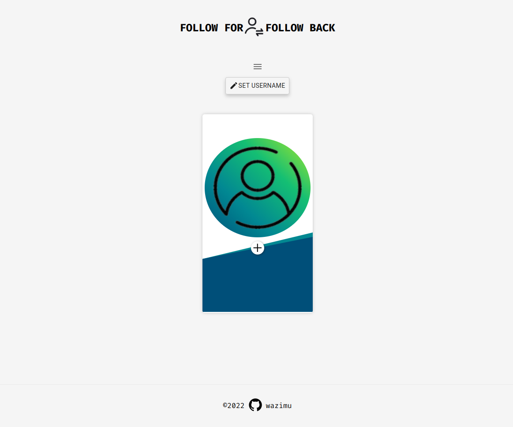

# Follow For Follow Back

## Find your mutual connections on GitHub with Follow for Follow back

[](https://follow-for-follow-back.vercel.app/)

[](https://follow-for-follow-back.vercel.app/)

[](https://follow-for-follow-back.vercel.app/)

[](https://follow-for-follow-back.vercel.app/)

[](https://follow-for-follow-back.vercel.app/)

[](https://follow-for-follow-back.vercel.app/)

[](https://follow-for-follow-back.vercel.app/)

[](https://follow-for-follow-back.vercel.app/)

[](https://follow-for-follow-back.vercel.app/)

## Setup

```bash
# Clone the repo
git clone https://github.com/hesbon-osoro/follow-for-follow-back.git

# Navigate the directory and install the packages
cd follow-for-follow-back && yarn

# Start the App
npm run dev
# or
yarn dev
```

Open [http://localhost:3000](http://localhost:3000) with your browser to see the result.

[`Live`](https://follow-for-follow-back.vercel.app/)

<Roles || Offers || Opportunities?? [`Mail`](mailto:hesbonosoro1@gmail.com) Me!>

<<---WorkFromHome/ Remote--->>

_Actively interviewing_

<Mail me your coding assignment: hesbonosoro1@gmail.com>

[](https://www.buymeacoffee.com/wazimu)

OR [`Paypal`](https://www.paypal.com/) use <hesbonosoro1@gmail.com>

Thank you.
